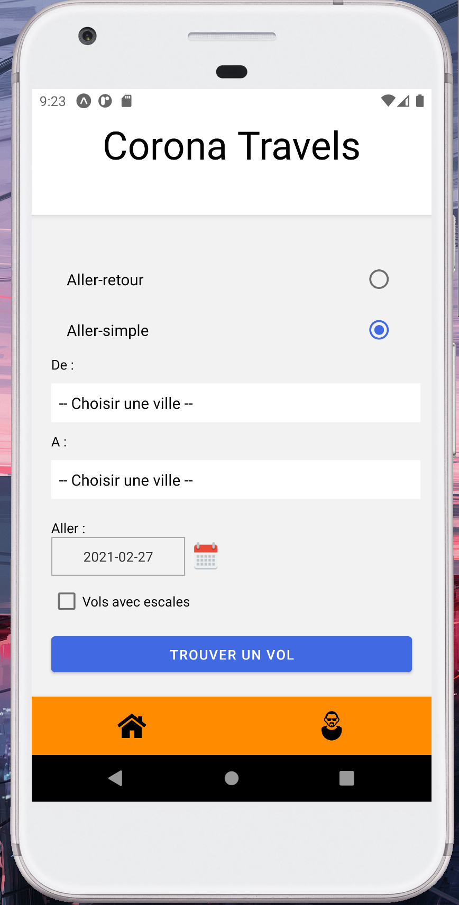
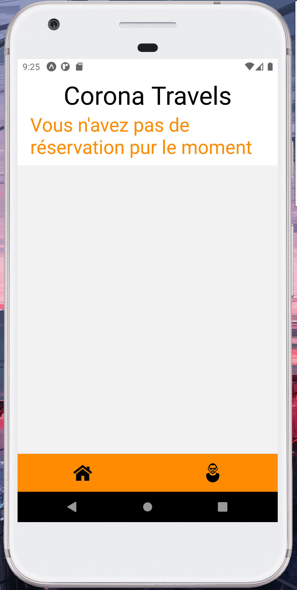
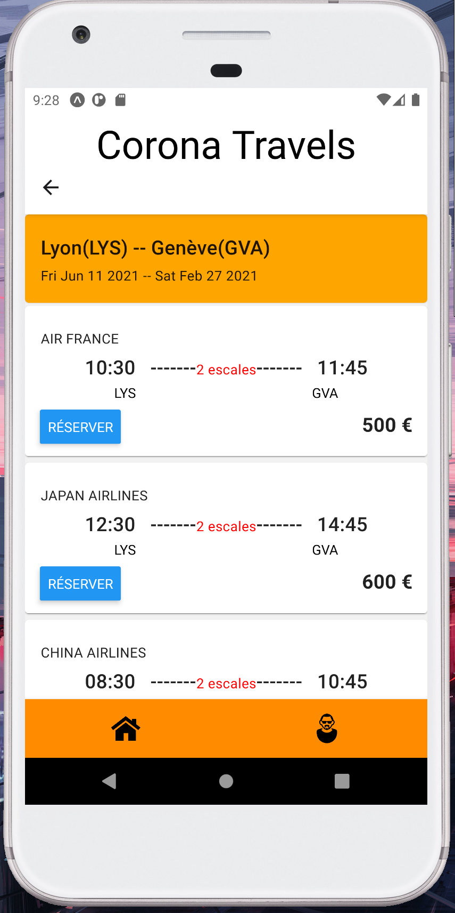
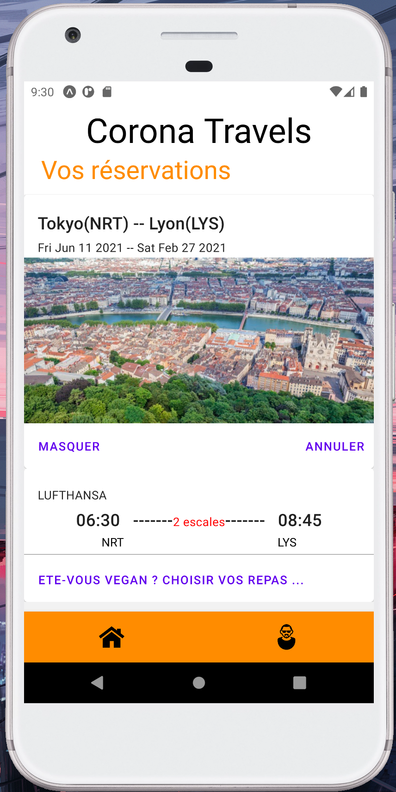
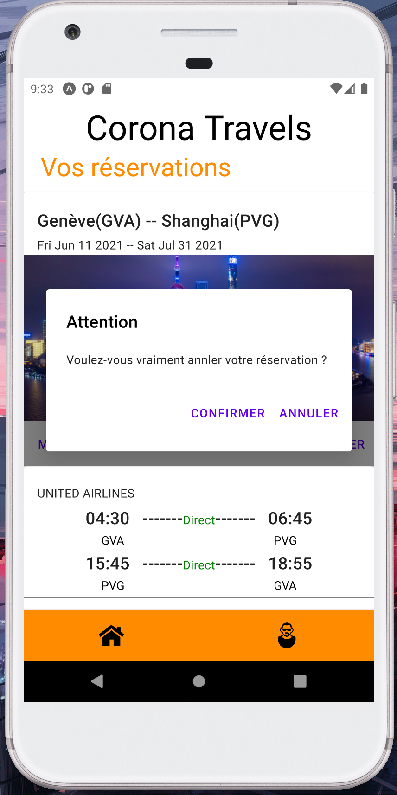

# corona-travels
🙂Bienvenue dans ma première application mobile codé en javascript **React Native**🤔💭💡dans l'objectif 🏹 d'apprendre le langage 🤹

📚**Sommaire**
<ul>
<a href="#installation"><li>Installation</li></a>
<a href="#maquette"><li>Maquette</li></a>
<a href="#realisation"><li>Réalisation</li></a>
<a href="#notice"><li>Notice d'utilisation</li></a>
</ul>
<hr>


**<h2 id="installation">⚙️ Installation ⚙️</h2>**<br>
>**prérequis** : Node.js et NPM installées sur la machine<br>
Vérifier si vous avez déjà node et npm installées, utiliser les commandes suivante:<br>

<code>node -v</code><br>
<code>npm -v</code>

>**problème** : Il se trouve que c'est possible que expo-font pose problème sur l'affichage des icons, si c'est le cas, supprimez ce dossier et effectuer les démarches suvantes:<br>

<code>npm install</code><br>
<code>expo start -c</code>

**<h2 id="maquette">🎪 Maquette 🎪</h2>**


```javascript
<View>
	<Header>
		<Text></Text>
		<Image/>
	<Header>
	<Form> 
		<InputRadio/>
		<InputText/>
		<InputText/>
		<InputDatetimeLocal/>
		<InputDatetimeLocal/>
		<InputSelection/>
		<InputCheckbox/>
		<Button></Button>
	</Form>
</View>
```


```javascript
<View>
	<Header>
		<Text></Text>
		<Image/>
	</Header>
	<ShowSearch>
		<Text></Text>
		<Text></Text>
		<Text></Text>
	</ShowSearch>
	<ShowVol>
		<Image/>
		<Text></Text>
		<Text></Text>
		<Text></Text>
	</ShowVol>
</View>
```


```javascript
<View>
	<Header>
		<Image/>
		<Text></Text>
	</Header>
	<ShowBooking>
		<Logo>
		<Text></Text>
		<Image/>
		</Logo>
		<Text></Text>
		<Text></Text>
		<Button></Button>
	</ShowBooking>
</View>
```

**<h2 id="realisation">🤸 Réalisation 🤸</h2>**

>**<h3>Main page :</h3>**

<ul>
    <li>
        <p>Le client peut choisir son type de voyage : <strong>aller retour</strong> ou <strong>aller simple</strong></p>
    </li>
    <li>
        <p>Le client peut choisir sa <strong>ville de départ</strong> et sa <strong>destination</strong></p>
    </li>
    <li>
        <p>Le client peut choisir la <strong>date de départ</strong> et la <strong>date de retour</strong> (<em>dans le cas d'aller simple il n'y aura pas de retour</em>)</p>
    </li>
    <li>
        <p>Le client peut choisir des vols <strong>avec ou sans escales</strong></p>
    </li>
    <li>
        <p>Boutton "TROUVER UN VOL" nous envoie sur <strong>search-page</strong> juste en-desous</p>
    </li>
    <li>
        <p>L'icon "maison" et "profile" nous permettent de swicher entre le main page et profile client</p>
    </li>
</ul>






>**<h3>Search page : </h3>**

<ul>
    <li>
        <p>La partie orange affiche <strong>les critères de recherche</strong> du client</p>
    </li>
    <li>
        <p>Les vols proposés sont <strong>générés</strong> selon les critères du client, voir le ficher <em>data.json</em></p>
    </li>
    <li>
        <p>Le boutton "RESERVER" nous permet d'ajouter le vols <strong>séléctionné</strong> dans le profil client, de ce fait le client peut le consulter via profile client qui est juste après</p>
    </li>
</ul>




>**<h3>Account page : </h3>**

<ul>
    <li>
        <p>Sur la première partie, le client voit les détails de son voyage et une <strong>jolie photo</strong> de la destination</p>
    </li>
    <li>
        <p>Le boutton "GERER" <strong>déplit la partie détail</strong> de ses vols, le client va pouvoir gérer sa réservation</p>
    </li>
    <li>
        <p>le boutton "ANNULER" fait apparaitre <strong>une confirmation de suppression</strong>, le client va pouvoir supprimer sa réservation</p>
    </li>
</ul>





**<h2 id="notice">🎲 Notice d'utilisation 🎲</h2>**
<h3>😉 Comming soon</h3>