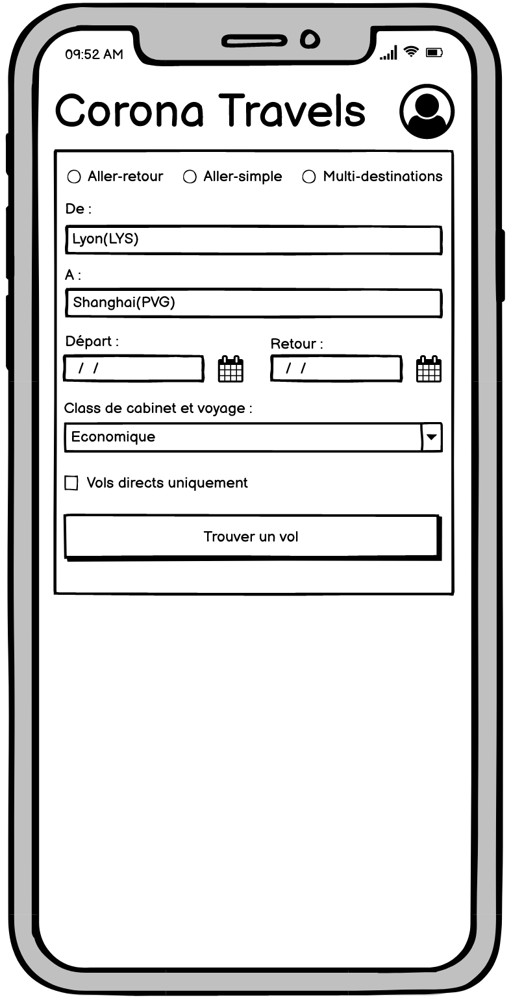
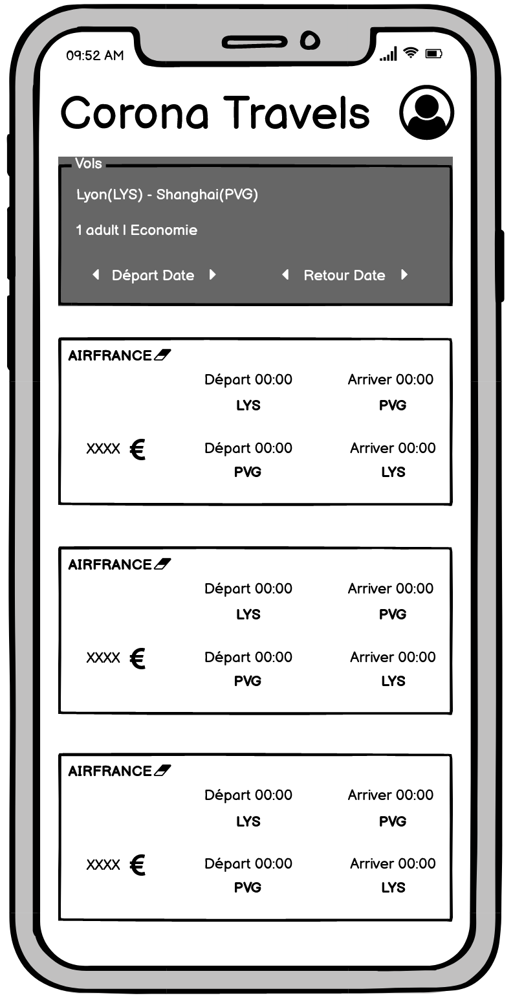
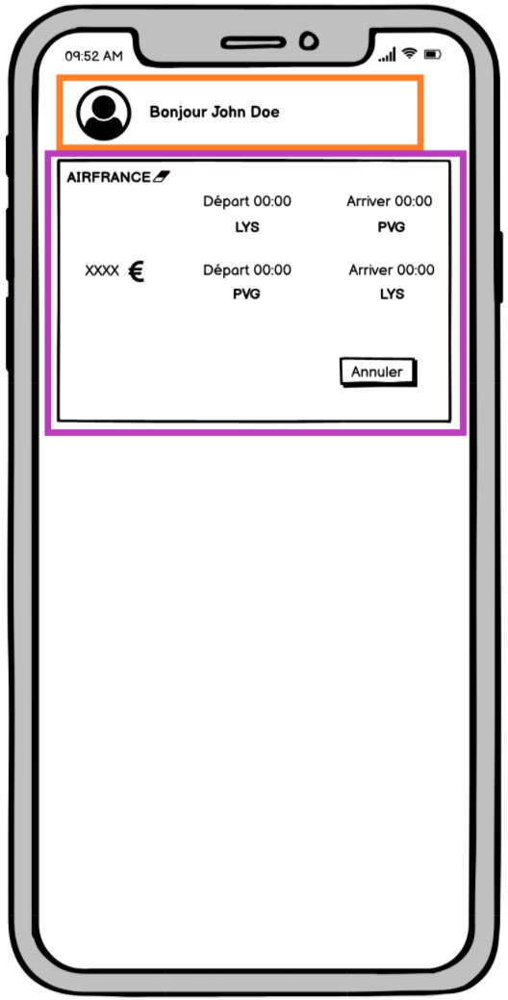
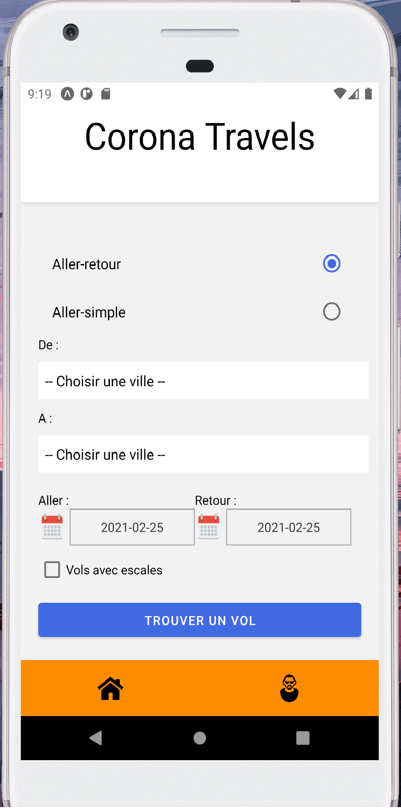
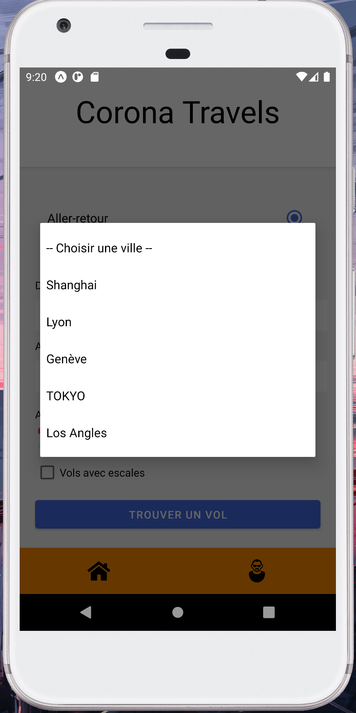
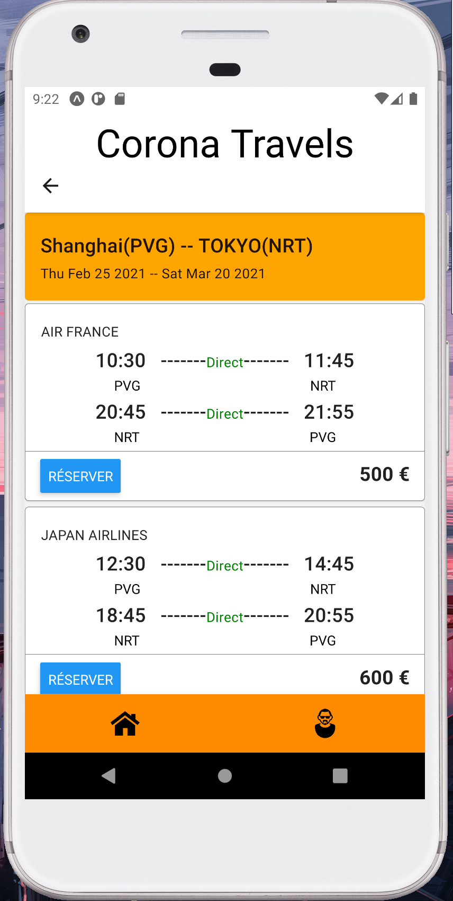

# corona-travels
🙂Bienvenue dans ma première application mobile codé en javascript **React Native**🤔💭💡dans l'objectif 🏹 d'apprendre le langage 🤹

📚**Sommaire**
<ul>
<a href="#installation"><li>Installation</li></a>
<a href="#maquette"><li>Maquette</li></a>
<a href="#realisation"><li>Réalisation</li></a>
<a href="#notice"><li>Notice d'utilisation</li></a>
</ul>

**<h2 id="installation">⚙️Installation</h2>** 
<code>npm install</code>

**<h3>Qu’est-ce que npm (Node Package Manager) ?</h3>**
npm (Node Package Manager) est le gestionnaire de paquets officiel de Node.js. Il permet de télécharger et d’installer des paquets (encore appelés modules) pour pouvoir les utiliser pour un projet ou au contraire de partager des paquets pour que d’autres utilisateurs puissent les utiliser.

Un “package” ou “paquet” ou encore “module” est un bloc de code cohérent composé de différentes fonctions qui permet d’effectuer une tâche. Utiliser des paquets permet de ne pas avoir à réinventer la roue et de ne pas tout coder nous même : si d’autres développeurs ont déjà développé une fonctionnalité qui nous intéresse, pourquoi ne pas la réutiliser ?

A la base, npm devait uniquement servir de package manager pour Node. Cependant, ce gestionnaire de paquet étant Open Source et ayant été très rapidement adopté par une large communauté de développeurs, il a évolué pour devenir un package manager beaucoup plus global pour l’ensemble du JavaScript et de son environnement et dépassant ainsi le cadre de Node.

Npm est aujourd’hui le plus grand registre de paquets au monde avec plus d’un million de paquets disponibles.

En tant que développeurs, nous allons donc très souvent utiliser npm pour installer des paquets qui nous intéressent comme React, Express, Moment, Request, Lodash, Async, Chalk, Sass ou encore Debug.

**<h2 id="maquette">🎪 Maquette</h2>**

**<h2 id="realisation">🤸 Réalisation</h2>**

**<h2 id="notice">🎲 Notice d'utilisation</h2>**
<h3>😉 Bonne chance</h3>